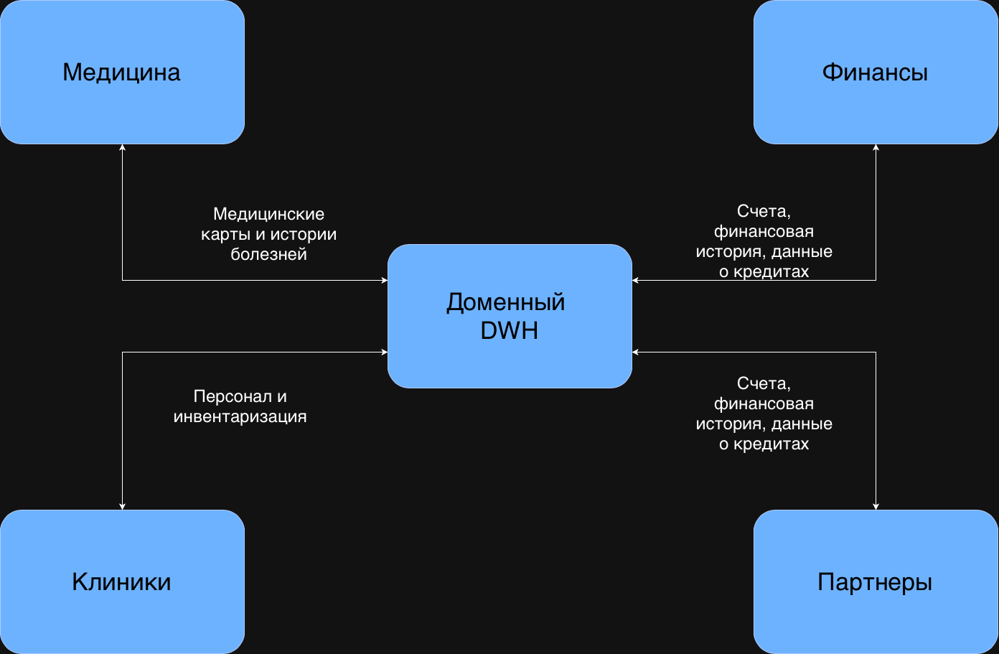

# Задание 2. Разделение системы на домены и моделирование потоков данных для поддержки ключевых бизнес-сценариев

## Домены

1. Медицина - домен отвечает за медицинские данные пациентов и анализы
2. Клиники - управление персоналом, пациентами и инвентаризация
3. Финансы - счета, история, данные о кредитах 
4. Интеграция (партнеры) - отвечает за "общение" с партнерами, сбор данных и предоставление информации

### Аргументация

Такой способ разделения на домены позволит сохранять управление данными внутри домена. Команда домена должна состоять из:
- Оператор, который вносит данные
- Команда разработки 
- Команда ИИ-сервисов
- Аналитик 
- Команда инфраструктуры

Данный способ также позволит внедрять, масштабировать и развертывать сервисы независимо. Это означает гибкость и ускорение выхода продуктов. 

## DFD

