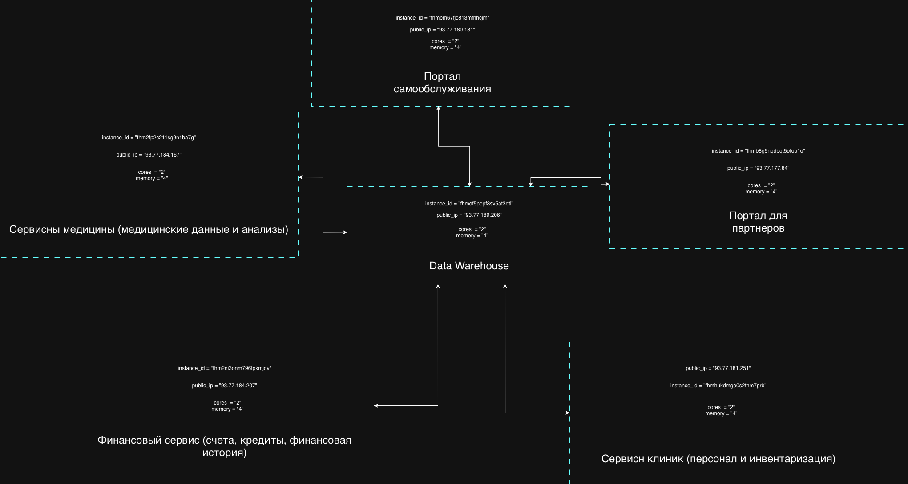

# Задание 4. Проектирование облачной инфраструктуры с применением IaaS и Terraform 1

## Диаграмма автоматизации развёртывания



## Конфигурация

```sh
Apply complete! Resources: 12 added, 0 changed, 2 destroyed.

Outputs:

clinic-service_instance_id = "fhmhukdmge0s2tnm7prb"
clinic-service_public_ip = "93.77.181.251"
data-warehouse_instance_id = "fhmof5pepf8sv5at3dtl"
data-warehouse_public_ip = "93.77.189.206"
finance-service_instance_id = "fhm2ni3onm796tpkmjdv"
finance-service_public_ip = "93.77.184.207"
medicine-service_instance_id = "fhm2fp2c211sg9n1ba7g"
medicine-service_public_ip = "93.77.184.167"
partner-service_instance_id = "fhmb8g5nqdbqt5ofop1o"
partner-service_public_ip = "93.77.177.84"
self-service-portal_instance_id = "fhmbm67fjc813mfhhcjm"
self-service-portal_public_ip = "93.77.180.131"
subnet_id = "e9b3fpm53qohe1gcufqa"
```